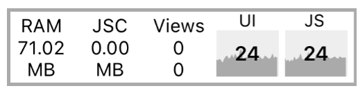

## ReactNative复习内容

### 性能优化

    Q:  在一个页面当中，当SetState的时候，如果进行优化保证页面在最小的幅度进行刷新？

    A:  在页面当中不进行setState，通过组件的ref进行setState，这样就可以确保组件自己刷新，但不会影响到其他的组件。

* * *
#### 官网文档篇---性能

##### 调试界面打开Show FPS Monions

如果在一个很复杂的应用根组件上调用setState，会导致一个很大开销的子组件重绘。假如这次开销话费200ms，那么就会丢失12帧。

这种情况，例如在老的Navigator导航器切换过程中：push一个新的路由的时候，JavaScript需要绘制新场景所需要的所有组件，以发送正确的命令给原生端去创建视图。由于切换是由JavaScript线程所控制，因此经常占用若干帧的时间，引起一些�段。有的时候，组件会在componentDidMount函数中做一些额外的事情，这甚至可能会导致页面切换过程中多达一秒的卡顿。

另一个例子是老的触摸事件响应：如果你正在JavaScript线程处理一个跨越多个帧的工作，你可能会注意到TouchableOpacity的响应被延迟了。这是因为JavaScript线程太忙了，不能够处理主线程发送过来的原始触摸事件，结果TouchableOpacity就不能及时响应这些事件并命令主线程的页面去调整。

##### UI帧率（主线程）
当JavaScript线程卡主时候，你仍然可以上下滚动ScrollView，因为ScrollView运行在主线程上（尽管滚动事件会被分发到JS线程，但是接受这些事件对于滚动这个动作来说并不重要）

    * * *
#### 性能问题的常见原因
##### 开发模式（dev=true）
    开发模式还会有许多事情做，例如收到警告和错误信息，验证类型等等错误。
##### console.log语句
    控制台打印会极大拖累JavaScript线程。确保删掉或者备注掉这些log。
    使用__DEV__判断是否是开发环境，然后在里面进行log。
##### ListView、FlatList
    当你用大量数据渲染ListView时候，性能会很差，使用FlatList代替
    当FlatList渲染很慢的时候，确保用getItemLayout来使得渲染更快。
##### 重绘一个几乎没有变化的页面时，JS帧率严重降低
    实现shouldComponentUpdate函数来指明什么样情况下重绘。
    
###### PureComponent
    将更新的state和props与当前的state和props进行对比，如果不一样则刷新界面，但是当state和props的结构复杂情况下，会有误差。
###### immutable
    immutable是一个创建之后不可以进行修改的数据，每当对immutable对象进行赋值的时候，就会返回一个新的immutable对象。
    immutable可以进行高效的对比，可以结合到shouldComponentUpdate里使用。
##### 移动视图掉帧
    ios上尽量少用opacity，减少GPU负担
##### 动画改变图片尺寸
    使用transform[{scale}]样式改变尺寸
    
#### 拆包RAM bundles和内联使用
##### 加载JavaScript
    先加载所需要的部分，之后再组件加载更多的包
##### 内联引用
    使用require代替import可以延迟模块加载，直到实际需要的时候再加载。
    
#### 启用RAM格式
    再iOS上使用RAM格式将创建一个简单的索引文件，React Native将根据此文件一次加载一个模块。在Android上，默认情况下它会为每个模块创建一组文件。
    Xcode中启用RAM格式，在build phase里编辑“Build React Native code and images”：
        export BUNDLE_COMMAND="ram-bundle"
        export NODE_BINARY=node
        ../node_modules/react-native/scripts/react-native-xcode.sh.sh

