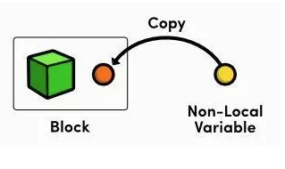
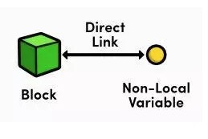
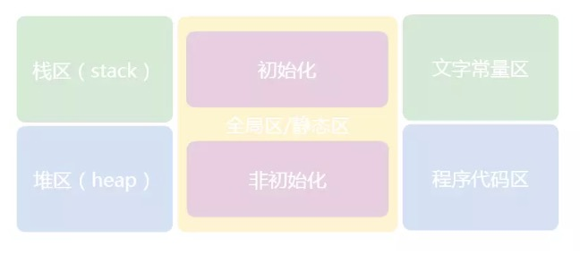
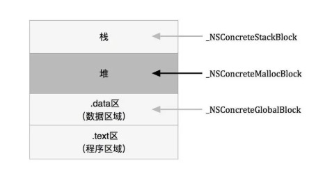
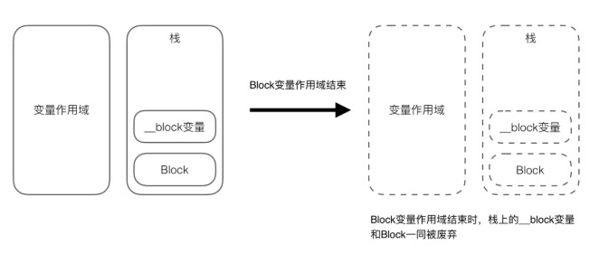
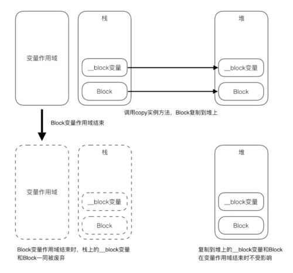
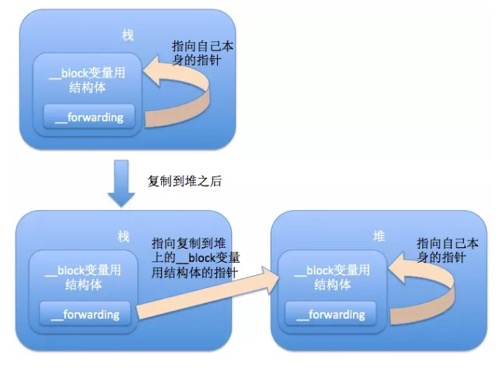

# 概述
## Block

* 可以嵌套定义，定义Block方法和定义函数方法相似
* Block可以定义在方法内部或外部
* 只有调用Block的时候才会执行其`{}`内代码
* 本质是对象，使代码高聚合


* * *
使用Clang将OC代码转换为C++文件查看block的方法：

* 在命令行输入`clang -rewrite-objc`需要编译的`OC`文件`.m`
* 这时查看当前的文件夹里多了一个相同的名称的`.cpp`文件，在命令行输入`open main.cpp`查看

# 定义与使用
## 无参数无返回值
```objectivec
void(^MyBlockOne)(void) = ^(void) {
    // CODE HERE...
}

MyBlockOne();
```

## 有参数无返回值
```objectivec
void(^MyBlockTwo)(int a) = ^(int a) {
    // CODE HERE...
}
MyBlockTwo(100);
```

## 有参数有返回值
```objectivec
int(^MyBlockThree)(int, int) = ^(int a, int b) {
    // CODE HERE...
    return a + b;
}
MyBlockThree(12, 56);
```

## 无参数有返回值
```objectivec
int(^MyBlockFour)(void) = ^{
    return 45;
}
MyBlockFour();
```
## 实开发中常用typedef定义Block
```objectivec
typedef int (^MyBlock)(int, int);
```
这时，`MyBlock`就成为了一种`Block`类型
可以这么定义属性
```objectivec
@property (nonatomic, copy) MyBlock myBlockOne;
```

# Block与外界变量
## 截获自动变量（局部变量）值
### 默认情况
对于`block`外的变量引用，block默认是将其复制到其数据结构中来实现访问。也就是`block`的自动变量截获只针对`block`内部使用的自动变量，不使用则不截获，因为截获的自动变量会存储于`block`的结构体内部，会导致`block`体积变大。特别注意的是默认情况下block只能访问不能修改局部变量的值。



```objectivec
int age = 10;
myBlock block = ^{
    NSLog(@"age = %d", age);
};
age = 18;
block();

// output:
// age = 10
```

### __block修饰的外部变量
对于`__block`修饰的外部变量引用，`block`是复制其引用地址来实现访问的。`block`可以修改`__block`修饰的外部变量的值。


```objectivec
__block int age = 10;
myBlock block = ^{
    NSLog(@"age = %@", age);
};
age = 18;
block();

// output:
// age = 18
```

为什么使用`__block`修饰的外部变量的值可以被`block`修改呢？
使用clang将OC代码转换为C++文件：
```C
__block int val = 10;
// turn to 
__Block_byref_val_0 val = {
    0,
    &val,
    0,
    sizeof(__Block_byref_val_0),
    10
};
```
发现一个局部变量加上`__block`修饰符后和`block`一样变成了一个`__Block_byref_val_0`结构体类型的自动变量实例。
此时我们在`block`内部访问`val`变量则需要通过一个叫`__forwarding`的成员变量来间接访问`val`变量。

## Block的copy操作
### Block的存储域及copy操作
`Block`的存储在栈上还是在堆上？


`block`有三种类型

* 全局块`_NSConcreteGlobalBlock`
* 栈块`_NSConcreteStackBlock`
* 堆块`_NSConcreteMallocBlock`

三种`block`各自存储域如下：


* 全局块存在于全局内存中，相当于单例。
* 栈块存在于栈内存中，超出其作用域则马上被销毁。
* 堆块存在于堆内存中，是一个带引用计数器的对象，需要自行管理其内存。

简而言之，存储在栈中的Block就是栈块，存储在堆中就是堆块，既不在栈中也不在堆中就是全局块。

#### 判断

1. `Block`不访问外界变量（包括栈中和堆中的变量），这样`Block`既不在栈中也不在堆中，在代码段中，为全局块。
2. `Block`访问外界变量
    1. `MRC`环境下：访问外界变量的`Block`默认存储在栈中。
    2. `ARC`环境下：访问外界变量的`Block`默认存储在堆中（实际放在栈区，然后`ARC`情况下自动又拷贝到堆区），自动释放。

```
ARC下，方位外界变量的Block为什么要自动从栈区拷贝到堆区？
栈上Block，如果其所属的变量作用域结束，该Block就被废弃，如同一般的自动变量。当然Block中的__block变量也同时被废弃。
```

```
为了解决栈块在其变量作用于结束之后被释放的问题，我们需要把Block复制到堆中，延长其生命周期。开启ARC时，大多数情况下编译器会恰当地进行判断是否有需要将Block从栈复制到堆，如果有，自动生成将Block从栈上复制到堆上的代码。Block的复制操作执行的是copy实例方法。Block只要调用了copy方法，栈块就会变成堆块。
```


```objectivec
typedef int(^blk_t)(int);
blk_t func(int rate) {
    return ^(int count) {
        return rate * count
    }
}
```
分析可知：上面函数返回的Block是配置在栈上的，所以返回函数调用时，`Block`变量作用域就`结束了`，`Block`会被废弃。但是在`ARC`有效，这种情况编译器会`自动完成复制`。
在`非ARC`情况下则需要开发者调用`copy方法`手动复制。
将`Block`从`栈`上复制到堆上相当消耗CPU，所以当`Block`设置在`栈`上也能够使用时，就不要复制了。

`Block`的复制操作执行的是`copy实例方法`。不同类型的`Block`使用`copy方法`的效果如下:
|Block的类|副本源的配置存储域|复制效果
|--|--|--|
|`_NSConcreteStackBlock`|栈|从栈复制到堆
|`_NSConcreteGlobalBlock`|程序的数据区域|什么都不做
|`_NSConcreteMallocBlock`|堆|引用计数器增加


根据表得知，在堆中copy会造成引用计数器增加，这与其他OC对象一样。虽然Block在栈中也是以对象的身份存在，但是栈没有引用计数，因为不需要，我们都知道栈去内有编译器自动分配释放。

不管`Block`存储域在何处，用`copy方法`复制都不会引起任何问题。在不确定时调用`copy方法`即可。在ARC有效时，多次调用copy方法完全没问题。

#### __block变量与__forwarding
在`copy操作`之后，既然`__block`变量也会被`copy`到堆上去，那么访问该变量是访问栈上的还是堆上的？
`__forwarding`

通过`__forwarding`，无论是在`block`中还是`block`外访问`__block`变量，也不管该变量在栈上或堆上，都能顺利地访问同一个`__block`变量。

#### 防止block循环引用
`Block`循环引用的情况：
某个类将`block`作为自己的属性变量，然后该类在`block`的方法体里面又使用了该类本身，如下：
```objectivec
self.someBlock = ^(Type var) {
    [self somemethod];
}
```
解决办法：
```objectivec
// ARC：使用__weak
__weak typeof(self) weakSelf = self;
self.someBlock = ^(type var) {
    [weakSelf somemethod];
}

// MARK：使用__block
__block typeof(self) blockSelf = self;
self.someBlock = ^(Type var) {
    [blockSelf somemethod];
}
```

#### strongSelf

weakSelf的作用是为了防止强循环引用，产生不必要的内存泄漏问题。但是为什么在block内还要重新声明转成strongSelf

因为在block内部的weakSelf可能为self或者为nil（比如当前界面正在加载网络数据，而此时用户关闭了该界面）这样在某些情况下代码会崩溃。所以为了让self不为nil，我们在block内部将weakSelf转成strongSelf。当block结束时，该strongSelf变量也会被自动释放。既比变了循环引用，又让self在block内部不为nil。
