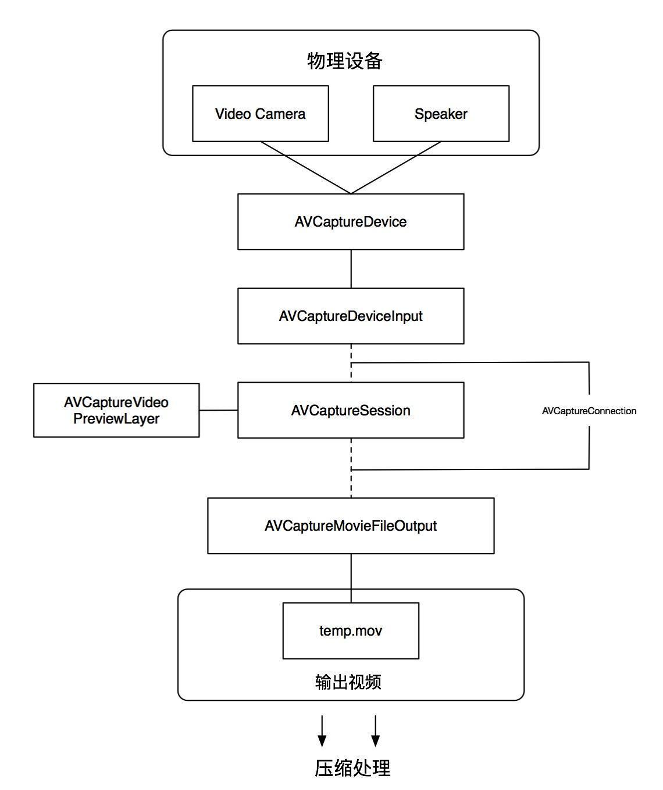

# 实现二维码扫描和生成

AVFoundation无论在扫描灵敏性和性能上来说都是最优的，需要兼容iOS6之前的版本可以用`zbar`或`zxing`代替。

## 扫描原理

扫码使用系统原生的AVCaptureSession类来发起的，这个类在官方文档中给出的解释是AVFundation框架中Capture类的中枢，起到管理协调的作用，而扫码是一个从摄像头（input）到解析出字符串（output）的过程，用AVCaptureSession来协调。其中是通过AVCaptureConnection来连接各个input和output，还可以用它来控制input和output的数据流向。

## 一、如何扫描二维码（相关类介绍）

使用系统提供的AVFoundation框架中提供的扫描API主要会用到以下几个类：

- AVCaptureSession 	// 输入输出的中间桥梁
- AVCaptureDevice 	// 获取摄像设备
- AVCaptureDeviceInput 	// 创建输入流
- AVCaptureMediaOutput 	// 创建输出流
- AVCaptureVideoPreviewLayer 	//扫描窗口

### AVCaptureSession

AVCaptureSession 是input和output的桥梁，协调input和output的数据传输，负责把补货的音视频数据输出到输出设备中。一个AVCaptureSession可以有多个输入输出

### AVCaptureDevice

AVCaptureDevice 代表输入设备（硬件设备），包括麦克风、摄像头，主要通过该对象设置物理设备的一些属性（例如相机焦距、白平衡等等）

- 前置和后置摄像头
- 闪光灯开关
- 手电筒开关（相机的闪光灯开关
- 焦距模式调整
- 曝光量调节
- 白平衡
- 距离调整

### AVCaptureDeviceInput

- 设备输入数据管理对象，可以根据AVCaptureDevice创建对应的AVCaptureDevice
Input对象，该对象将会被添加到AVCaptureSession中管理。

- AVCaptureDeviceInput代表着输入数据的设备（可以是子类），AVCaptureDevice适配AVCaptureDeviceInput，我们需要使用AVCaptureDeviceInput来让设备添加到session中，AVCaptureDeviceInput扶着管理设备端口。我们可以理解它为设备的抽象。一个设备可能可以同时提供视频和音频的捕捉。我们可以分别用AVCaptureDeviceInpiut来代表视频输入和音频输入。

### AVCaptureMediaOutput

- 为了session中取得数据，我们需要创建一个AVCaptureOutput，AVCaptureMediaOutput代表输出数据，管理者输出到一个movie或者图像，AVCaptureMetadataOutput是AVCaptureOutput的子类。

- 这里是与捕捉视频流不一致的地方。我们捕捉视频流需要的是AVCaptureVideoDataOuput，而在这里我们需要捕捉的是二维码信息。因此我们需要AVCaptureMetadataOutput。并且我们需要制定捕捉的metadataObject类型。在这里我们指定的是AVMetadataObjectTypeQRCode，我们还可以指定其他类型，例如PDF417条码类型。

### AVCaptureVideoPreviewLayer

扫描窗口（镜头捕捉到的预览图成）

## 二、使用AVFoundation拍照、扫描或视频的一般步骤如下：

1. 创建AVCaptureSession对象

2. 使用AVCaptureDevice的静态方法获得需要使用的设备，例如拍照和录像就都需要获得摄像头设备，录音就需要获得麦克风设备。

3. 利用输入设备AVCaptureDevice初始化AVCaptureDeviceInput对象。

4. 初始化输入数据管理对象，如果要拍照就初始化AVCaptureStillImageOutput对象；如果拍摄视频就初始化AVCaptureMovieFileOutput对象

5. 将数据输入对象AVCaptureDeviceInput、数据输出对象AVCaptureOutput添加到媒体回话管理对象AVCaptureSession中。

6. 创建视频预览图层AVCaptureVideoPreviewLayer并制定媒体回话，添加土城到显示容器中，调用AVCaptureSession的startRuning方法开始捕获。

## 四、从相册获取二维码扫描

- iOS8之后，可以视同CIDetector进行图片解析，从而使我们可以便捷的从相册中获取到二维码。

- 调用系统相册，从系统相册中先去图片

- 使用探测器对选取图片进行处理，取得图片二维码中包含的数据信息。

## 五、扫描二维码注意点

- info.plist 权限请求

- 使用AudioServices播放音效需要导入AudioToolbox.framework框架

- 图片很小的二维码

	- AVCaptureSession可以设置sessionPreset属性，这个决定了视频输入每一帧质量的大小。
	- 一般来说640x480就够使用，但是如果要保证较小的二维码图片能快速扫描，最好设置高些，如AVCaptureSessionPreset1920x1080

- scanCrop

	- 另一个提升扫描速度和性能的就是设置解析的范围，AVFoundation中设置AVCaptureMetadataOutput的rectOfinterest属性来配置解析范围。
