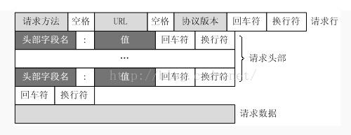
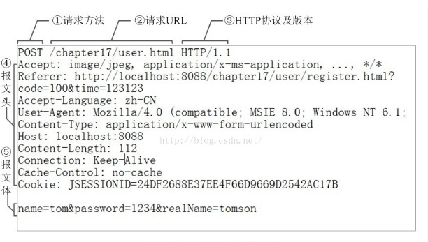
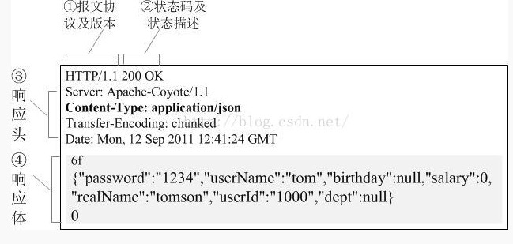

### HTTP报文
#### 请求报文
一个HTTP请求报文由四个部分组层：`请求行` `请求头部` `空行` `请求数据`
##### 请求行
请求行有请求方法字段、URL字段和HTTP协议版本字段3个字段组层，它们用空格分割。
比如 `GET /data/info.html HTTP/1.1`
方法字段就是HTTP使用的请求方法，如常见的**GET/POST**
其中HTTP协议版本有两种`1.0`和`1.1`
    
    HTTP1.0对于每个链接都只能传送一个请求和响应，请求就会关闭，HTTP1.0没有host字段。
    HTTP1.1在同一个链接中可以传送多个请求和响应，多个请求可以重叠和同事进行，HTTP1.1必须有Host字段。

##### 请求头部
HTTP客户程序，向服务器发送请求的时候必须指明请求类型。如有必要，客户程序还可以选择发送其他的请求头。大多数请求头并不是必须的，但Content-Length除外。对于POST请求来说Content-Length必须出现。

|字段|含义|
|---|---|
|Accept|浏览器可以接受的MIME类型|
|Accept-Charset|浏览器可以接受的字符集|
|Accept-Encoding|浏览器能够进行解码的数据编码方法，比如gzip|
|Accept-Language|浏览器所希望的鱼眼种类，当服务器能够提供一种以上的鱼眼版本时要用到|
|Authorization|授权信息，通常出现在对服务器发送的WWW-Authenticate头的应答中|
|Content-Length|表示请求消息正文的长度|
|Host|客户机通过这个头告诉服务器，想访问的主机名。Host头域制定请求资源的Intenet主机和端口号，必须表示请求url的原始服务器或网关的位置。HTTP/1.1请求必须包含主机头域，否则系统会以400状态码返回|
|If-Modified-Since|客户机通过这个头告诉服务器，资源缓存时间。只有当所有请求的内容在制定的时间后经过修改才返回它，否则返回304 Not Modified 应答|
|Referer|告诉服务器，它是哪个资源来访问服务器的（防盗链）。包含一个URL，用户从该URL代表的页面出发访问当前请求的页面|
|User-Agent|User-Agent头域的内容包含发出请求的用户信息。浏览器类型，如果Servlet返回的内容与浏览器类型有关则该值非常有用|
|Cookie|客户机通过这个头可以向服务器带数据，关键的请求头信息之一|
|Pragma|制定“no-cache”表示服务器必须返回一个刷新后的文档，及时它是代理服务器而且已经有了页面的本地拷贝|
|From|请求发送者的email地址，由一些特殊的Web客户程序使用，浏览器不会用到|
|Connection|处理完这次请求后是否断开连接还是继续保持连接。如果Servlet看到这里的值为“Keep-Alive”，或者看到请求使用HTTP1.1(默认持久连接)，它就可以利用持久连接的有点，当页面包含多个元素时，显著减少下载所需要的时间。|
|Range|Range头域可以请求实体的一个或者多个子范围|
|UA-Pixels/UA-Color/UA-OS/UA-CPU|某些版本的IE浏览器所发送的非标准的请求头，表示屏幕大小、颜色深度、操作系统和CPU类型|

##### 空行
它的作用是通过一个空行，高速服务器请求头部到此为止。

##### 请求数据
若方法字段是GET，则此项为空，没有数据。
若方法字段是POST，则同城来说此处防止的就是要提交的数据。
比如要使用的POST方法提交的一个表单，其中有`user`字段数据为`"admin"`，`password`字段为`123456`，那么这里的请求数据就是`user=adming&password=123456`，使用`&`来连接各个字段

上面是POST方法，它的请求行URL段中一般是没有参数的，参数放在了报文体中。而GET方法的参数直接置于请求行URL中，报文体则为空。

#### 响应报文
同样的，HTTP响应报文也由三部分组层：`响应行` `响应头` `响应体`

##### 响应行
响应行一般由协议版本、状态码以及描述组成。
比如 `HTTP/1.1 200 OK`

#### 响应头
响应头用于描述服务器的基本信息，以及数据的描述，服务器通过这些数据的描述信息，可以通知客户端如何处理等一会它回送的数据。
|字段|含义|
|---|---|
|Allow          |服务器支持哪些请求方法|
|Content-Encoding|文档的编码(Encoding)方法，只有在解码之后才能得到content-Type头制定的内容类型。利用gzip压缩文档技术能够显著地减少HTML文档的下载时间|
|Content-Length|表示内容长度。当浏览器使用持久HTTP连接时才需要这个数据|
|Content-Type|表示后面文档属于什么MIME类型。Servlet默认为text/plain，单通常需要显示制定为text/html|
|Date|当前的GMT时间，可以setDateHeader来设置这个头避免转换时间的麻烦|
|Expires|告诉浏览器把回送的资源缓存多长时间，-1或0则是不缓存|
|Last-Modified|文档的最后改动时间。客户可以通过If-Modified-Since请求头提供一个日期，该请求将被视为一个条件GET，只有改动时间迟于指定时间的文档才会返回，否则返回一个304(Not Modified)状态。Last-Modified也可用setDateHeader方法来设置|
|Location|这个头配合302状态码使用，用于重定向接受者到一个新URL地址|
|Refresh|高速浏览器隔多久刷新一次，以秒计
|Server|服务器通过这个头告诉浏览器服务器的类型。Server响应头包含处理请求的原始服务器的软件信息，此域能包含多个产品标识和注释，产品标识一般按照重要性排序。Servlet一般不设置这个值，而是由Web服务器自己设置|
|Set-Cookie|设置和页面关联的CookieServlet不应使用response.setHeader("Set-Cookie", ...)，而是应使用HttpServletResponse提供专用方法addCookie|
|Transfer-Encoding|告诉浏览器数据的传送格式|
|WWW-Authenticate|客户应该在Authorization头中提供什么类型的授权信息。在包含401状态行的应答中这个头是必需的|
|setContentType|设置Content-Type头|
|setContentLength|设置Content-Length|
|addCookie|设置一个Cookie|
##### 响应体
响应体就是响应的消息体，如果是纯数据就是返回纯数据，如果请求的是HTML页面，那么返回的就是HTML代码，如果是JS，就是JS代码...

HTTP响应报文格式如下

>[通用头，实体头](https://blog.csdn.net/shouwang666666/article/details/70232053/)

* * *
#### POST GET
##### GET
    GET是最常见的请求，最常用雨向服务器查询某些信息。必要时，可以将查询字符串参数追加到URL的末尾，以便将信息发送给服务器。
##### POST
    POST请求应该把数据作为请求的主体提交，其请求的主体可以包含非常多的数据，而且格式不限。
    POST请求必须设置Content-Type值为application/x-form-www.urlencoded,如果不设置Content-Type头部信息，那么发送给服务器的数据就不会出现在$_POST超全局变量中。
##### 区别

1. 使用Get请求时，参数在URL中显示，而使用Post请求，则不会显示出来
2. Post传输的数据量大，可以达到2M，而Get方法由于受到URL长度限制，只能传递大约1024字节
3. Get请求需注意缓存问题，Post请求不需要担心
4. Post请求必须设置Content-Type为application/x-form-www.urlencoded
5. 发送请求时，因为Get请求参数都在url里，所以send函数发送的参数为null，而Post请求在使用send方法时，却需赋予其参数
6. Get方式请求的数据会被浏览器缓存起来，因此其他人可以从浏览器的历史记录中读取到这些数据。某种情况下，Get方法会带来严重的安全问题，Post方式相对来说就可以避免这些问题

#### 一次完整的Http请求

1. 建立TCP连接
2. 客户端发送请求指令
>`GET/sample/hello.jsp HTTP/1.1`
3. 客户端发送请求头信息，如果最后发送一个空请求头代表发送请求头信息发送完毕，如果是POST请求，会继续提交。
4. Web服务器应答，第一部分为版本号和协议状态
>`HTTP/1.1 200 OK`
5. Web服务器发送应答头信息，关于它自己的信息以及被请求的文档，最后发送一个空白行表示头信息发送结束
6. Web服务器向浏览器发送数据，以Content-Type应答头信息所描述的格式发送用户所请求的时机数据
7. Web服务器关闭TCP连接，一旦Web服务器向浏览器发送了请求数据，他就要关闭TCP连接
>`添加了Connection:keep-alive TCP连接会在发送后仍然保持打开状态`
