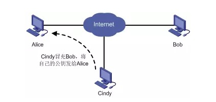
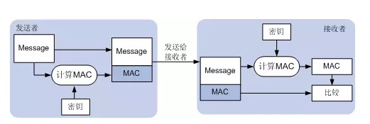
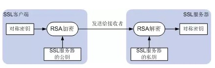

### HTTPS握手
HTTPS在HTTP的基础上加入了SSL协议，SSL依靠证书来验证服务器的身份，并为浏览器和服务器之间的通信加密。

1. 客户端发起`HTTPS`请求
2. 服务端的配置
采用HTTPS协议的服务器必须要有一套数字证书，可以是自己制作或者是CA证书。区别就是自己办法的证书需要客户端验证通过，才可以继续访问。而使用CA证书则不会弹出提示页面。这套证书就是一对公钥和私钥。公钥给别人加密私用，私钥给自己解密使用。
3. 传送证书
这个证书其实就是公钥，只是包含了很多信息，如证书的颁发机构，过期时间等。
4. 客户端解析证书
这部分工作是有客户端的TLS来完成的，首先会验证公钥是否有效，比如颁发机构，过期时间等，如果发现异常，则会弹出一个警告框，提示证书存在问题。如果证书没有问题，那么久生成一个随机值，然后用证书对该随机值进行加密。
5. 传送加密信息
这部分传送的是用证书加密后的随机值，目的是让服务器得到这个随机值，以后客户端和服务端的通信就可以通过这个随机值来进行加密解密了。
6. 服务端解密信息
服务端用私钥解密后，得到了客户端传过来的随机值（私钥），然后把内容通过该值进行对称加密。所谓对称加密就是，将信息和私钥通过某种算法混的在一起，这样除非知道私钥，不然无法获取内容，而正好客户端和服务端都知道这个私钥，所以只要加密算法够彪悍，私钥够复杂，数据就够安全。
7. 传输后加密的信息
这部分信息是服务端用私钥加密后的信息，可以在客户端被还原。
8. 客户端解密信息
客户端之前生成的私钥解密服务端传过来的信息，于是获取了解密后的内容。
>整个握手过程第三方即使监听到了数据，也束手无策

#### 区别
1. `https`协议是需要到ca申请证书或自制证书。
2. `http`的信息是明文传输，`https`则是具有安全性的ssl加密。
3. `http`是直接与`TCP`进行数据传输，而`https`协议是经过一层`SSL`（`OSI`表示层），用得端口不一样，前者是80（需要国内备案），后者是443。
4. `http`的连接很简单，是无状态的；`HTTPS`系诶一是由`SSL+HTTP`协议构建的可进行加密传输、身份认证的网络协议，比`HTTP`协议安全。

#### HTTPS加密是在传输层
`https`报文在被包装成`tcp`报文的时候完成加密过程，无论是`https`的`header`域也好，`body`域也好，都是被加密的。
当使用`tcpdump`或者`wireshark`之类的`tcp`层工具抓包，获取的是加密的内容，而如果用应用层抓包，使用`Charels`、`Fildder`抓包工具，那么就是明文的。

* * *
### SSL
#### 原理
##### 身份验证机制
非对称密钥算法可以用来实现数字签名。由于通过私钥加密后的数据只能利用对应的公钥进行解密，因此根据解密是否成功，就可以判断发送者的身份，如同发送者对数据进行了“签名”。
使用数字签名验证身份时，需要确保验证者的公钥是真实的，否则，非法用户可能会冒充被验证着与验证者通信。如下图所示，Cindy冒充Bob，将自己的公钥发给Alice，并利用自己的私钥计算出签名发送给Alice，Alice利用“Bob”的公钥（实际上为Cindy的公钥）成功验证该签名，则Alice认为Bob的身份验证成功，而实际上于Alice通信是冒充Bob的Cindy。SSL利用PKI提供的机制保证公钥的真实性。

##### 数据传输的机密性
SSL加密通道上的数据加密解密使用对称密钥算法，主要支持的算法有DES、3DES、AES等。对称密钥算法要求密钥解密和加密密钥完全一致。因此，利用对称密钥算法加密传输数据之前，需要在通信两端部署相同的密钥。
##### 消息完整性验证
为了避免网络中传输的数据被非法篡改，SSL利用基于MD5或SHA的`MAC算法`来保证消息的完整性。
`MAC算法`是在密钥参与下的数据摘要算法，能将密钥和任意长度的数据转换为固定长度的数据。利用MAC算法验证消息完成性的过程入下图所示。
发送者在密钥的参与下，利用`MAC算法`计算出消息的MAC值，并将其加在消息之后发送给接受者。接受者利用相同的密钥和`MAC算法`计算出消息的MAC值，并与接受到的MAC值比较。如果二者相同，则报文没有改变；否则，报文在传输过程中被修改，接受者将丢弃该报文。

>`MAC算法`要求通信双方就要相同的密钥，否则MAC值验证将会失败。因此，利用MAC算法验证消息完整之前，需要在通信两端不熟相同的密钥。
##### 利用非对称密钥算法保证密钥本身安全
对称密钥算法和MAC算法要求通信双方具有相同的密钥，否则解密和MAC值验证将失败。因此，要建立加密通道或验证消息完整性，必须现在通信双方部署一致的密钥。
SSL利用非对称密钥算法加密密钥的方法实现密钥交换，保证第三方无法获取该密钥。
如下图所示，SSL客户端利用SSL服务器的公钥加密密钥，将加密的密钥发送给SSL服务器，只要拥有对应私钥的SSL服务器才能从密问中获取原始的密钥。SSL同城采用RSA算法加密传输密钥。（Server端公钥加密密钥，私钥解密密钥）

##### 利用PKI保证公钥的真实性
`PKI`通过数字证书来发布用户的公钥，并提供了验证公钥真实性的机制。`数字证书`（简称证书）是一个包含用户的公钥以及其身份信息的文件，证明了用户与公钥的关联。数字证书由权威机构——CA签发，并由CA保证数字证书的真实性。
SSL客户端把密钥加密传递给SSL服务器之前，SSL服务器需要将从CA获取的证书发送给SSL客户端，SSL客户端通过PKI判断该证书真实性。如果该证书确实属于SSL服务器，则利用该证书中的公钥加密密钥，发送给SSL服务器。
验证SSL服务器/SSL客户端的身份之前，SSL服务器/SSL客户端需要将从CA获取的证书发送给对端，对端通过`PKI`判断该证书的真实性。如果该证书确实属于SSL服务器/SSL客户端，则对端利用该证书中的公钥验证SSL服务器/SSL客户端的身份。

### TSL在SSL上主要增强的内容
>`TLS`主要目的是使`SSL`更安全，并使协议的规范更精准和完善。

`TLS`在`SSL V3.0`的基础上提供一下增强内容
* 更安全的MAC算法
* 更严密的警报
* “灰色区域“规范更明确的定义

### 中间人攻击
针对SSL的中间人攻击方式主要有两种，分别是SSL劫持攻击和SSL剥离攻击
#### SSL截止攻击
    SSL劫持攻击即SSL证书欺骗攻击，攻击者为了获得HTTPS传输的明文数据，需要先讲自己接入到客户端和目的网站之间；在传输过程中伪造服务器的证书，将服务器的公钥替换成自己的公钥，这样，中间人就可以得到明文传输带Key1、Key2和Pre-Master-Key，从而窃取客户端和服务端的通信数据。
    但是对于客户端来说，如果中间人伪造了证书，在校验证书过程中会提示证书错误，由于用户选择继续操作还是返回，由于大多数用户的安全意识不强，会选择继续操作，此时，中间人就可以获取浏览器和服务器之间的通信数据。
#### SSL剥离攻击
    这种攻击方式也需要将攻击者设置为中间人，之后见HTTPS范文替换为HTTP返回给浏览器，而中间人和服务器之间保持HTTPS服务器。由于HTTP是明文传输，所以中间人可以获取客户端和服务器传输数据。
